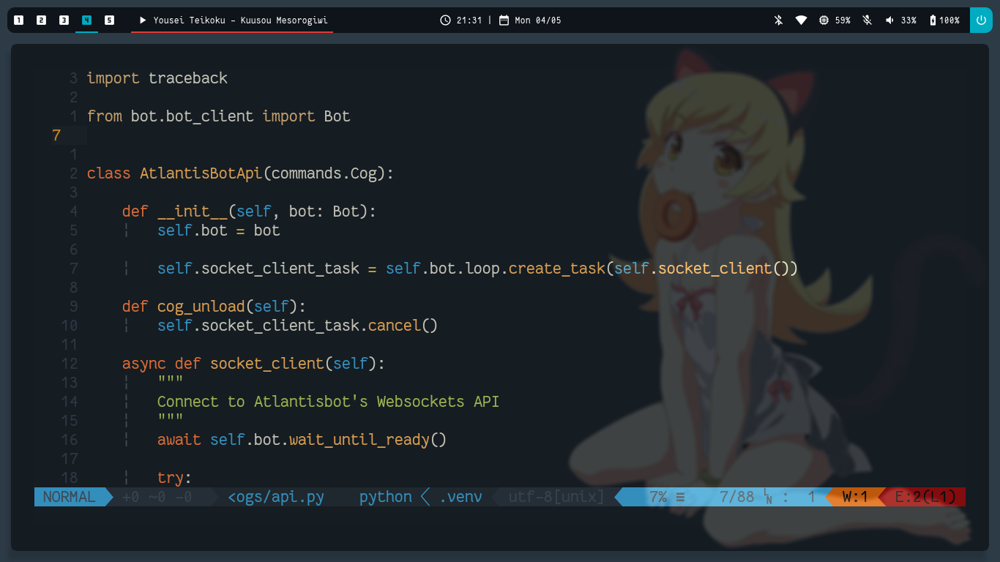

# My Dotfiles

Configuration files for zshrc, Neovim, Vscode, i3wm or mangowm, eww or polybar, and others.

| | |
|--------|-------------|
| I3 setup |  |
| MangoWM setup |  |

---

## Installation

**Requirements:** Node.js 24+

1. Clone the repository to `~/dotfiles`:
   ```bash
   git clone https://github.com/johnvictorfs/dotfiles.git $HOME/dotfiles
   ```

2. Run the wizard and select the modules you want to set up:
   ```bash
   node $HOME/dotfiles/wizard/init.ts
   ```

The wizard installs packages via `pacman`/[`paru`](https://github.com/Morganamilo/paru) (Arch-based distros only) and sets up symlinks for the selected configurations.

---

## Keybinds

<details>
<summary>
Keybinds
</summary>

- **Default <kbd>$mod</kbd> key:** <kbd>Super</kbd>

| Key | Action |
|-----|--------|
| <kbd>$mod</kbd> + <kbd>Shift</kbd> + <kbd>i</kbd> | Open config file in nvim |
| <kbd>$mod</kbd> + <kbd>h</kbd> | Switch to Horizontal tiling |
| <kbd>$mod</kbd> + <kbd>v</kbd> | Switch to Vertical tiling |
| <kbd>$mod</kbd> + <kbd><1-8></kbd> | Switch Workspace |
| <kbd>$mod</kbd> + <kbd>Shift</kbd> + <kbd><1-8></kbd> | Move active Window to Workspace and switch to it |
| <kbd>$mod</kbd> + <kbd>Shift</kbd> + <kbd>Space</kbd> | Toggle floating on active Window |
| <kbd>$mod</kbd> + <kbd>Space</kbd> | Toggle focus between floating or non-floating Window |
| <kbd>$mod</kbd> + <kbd>Ctrl</kbd> + <kbd>m</kbd> | Open audio settings |
| <kbd>$mod</kbd> + <kbd>f</kbd> | Toggle Active Window Full-screen |
| <kbd>$mod</kbd> + <kbd>Return</kbd> | Open Terminal Window |
| <kbd>$mod</kbd> + <kbd>n</kbd> | Open Notes |
| <kbd>$mod</kbd> + <kbd>&larr;</kbd> <kbd>&uarr;</kbd> <kbd>&rarr;</kbd> <kbd>&darr;</kbd> | Switch Active Window |
| <kbd>$mod</kbd> + <kbd>Ctrl</kbd> + <kbd>&larr;</kbd> <kbd>&uarr;</kbd> <kbd>&rarr;</kbd> | Resize active window |
| <kbd>$mod</kbd> + <kbd>Shift</kbd> + <kbd>&larr;</kbd> <kbd>&uarr;</kbd> <kbd>&rarr;</kbd> <kbd>&darr;</kbd> | Move Active Window |
| <kbd>$mod</kbd> + <kbd>d</kbd> | Open Application Launcher |
| <kbd>$mod</kbd> + <kbd>w</kbd> | Open Browser |
| <kbd>$mod</kbd> + <kbd>F3</kbd> | Open File Manager |
| <kbd>$mod</kbd> + <kbd>F2</kbd> | Open Music Player |
| <kbd>$mod</kbd> + <kbd>c</kbd> | Open Windowed Terminal Calculator |
| <kbd>$mod</kbd> + <kbd>q</kbd> | Close active Window |
| <kbd>PrtScr</kbd> | Region selection Screenshot with Flameshot |
| <kbd>Volume Up/Down</kbd> | Increase/Decrease Volume with Fn keys |
| <kbd>Volume Mute</kbd> | Mute/Unmute Volume with Fn keys |
| <kbd>$mod</kbd> + <kbd>0</kbd> | System Mode to lock/suspend/restart/shutdown etc. |
| <kbd>$mod</kbd> + <kbd>l</kbd> | Lock Screen |
| <kbd>$mod</kbd> + Click + Drag Window | Move floating window with the mouse |

</details>

---

## Main Packages used

- Terminal Emulator: [kitty](https://github.com/kovidgoyal/kitty)
- Shell: [zsh](https://www.zsh.org)
- Shell manager: [oh-my-zsh](https://github.com/ohmyzsh/ohmyzsh)
- Wayland setup:
  - Window Manager/compositor: [MangoWM](https://mangowm.github.io/)
  - Status bar: [waybar](https://github.com/Alexays/Waybar)
- Xorg setup:
  - Window Manager: i3wm
  - Status Bar: [polybar](https://github.com/polybar/polybar)
