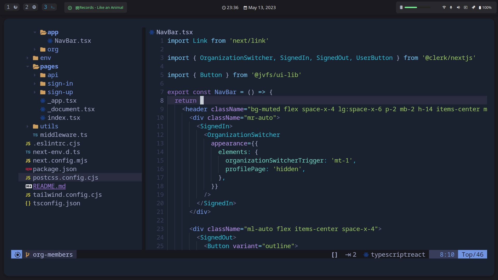

# My Dotfiles

Configuration files for zshrc (`.zshrc` and `.aliases`), Neovim (`init.vim`), Vscode, i3-gaps and others

---

## Installation

<details>
<summary>
Instructions
</summary>

- **Before Installing:** Most packages will attempt to be installed with `pacman` (Arch Repository Package Manager) or `yay` (AUR Package Manager), some Python (pip) packages will be installed as well in the setup script. Even then most configuration is distro-agnostic, and you can read below what you can and cannot run depending if you're running an Arch-based distro or not. You can just answer 'n' to every installation prompt when running the below scripts if you're not using an Arch-based distro, and install the needed packages manually with your preferred package manager if necessary.


- **Clone repository dotfiles to `~/dotfiles`:**
  ```bash
  git clone https://github.com/johnvictorfs/dotfiles.git $HOME/dotfiles
  cd $HOME/dotfiles
  ```

- **Zsh Setup:**
  ```bash
  # (installation with pacman, config is distro-agnostic)
  ./zsh.sh

  # Distro-agnostic, symlink .zshrc and .aliases files
  ./oh-my-zsh.sh
  ```

- **Neovim Setup:**
  > Installation with pacman, config is distro-agnostic

  ```bash
  ./nvim.sh
  ```

- **i3-gaps/rofi/kitty and some others Setup:**
  > Installation with yay, config is distro-agnostic

  ```bash
  ./setup.sh
  ```

- **VsCode Setup:**
  > Installation with pacman, config is distro-agnostic

  ```bash
  ./vscode.sh
  ```
</details>

---

## i3-gaps (rounded) and Kitty Setup


## Neovim setup ([ayu-theme (dark)](https://github.com/ayu-theme/ayu-vim))



---

## i3 Keybinds

<details>
<summary>
Keybinds
</summary>

- **Default <kbd>$mod</kbd> key:** <kbd>Super</kbd>

| Key | Action |
|-----|--------|
| <kbd>$mod</kbd> + <kbd>Shift</kbd> + <kbd>i</kbd> | Open i3 config file in nvim |
| <kbd>$mod</kbd> + <kbd>Shift</kbd> + <kbd>p</kbd> | Open Polybar config file in nvim |
| <kbd>$mod</kbd> + <kbd>h</kbd> | Switch to Horizontal tiling |
| <kbd>$mod</kbd> + <kbd>v</kbd> | Switch to Vertical tiling |
| <kbd>$mod</kbd> + <kbd><1-8></kbd> | Switch Workspace |
| <kbd>$mod</kbd> + <kbd>Shift</kbd> + <kbd><1-8></kbd> | Move active Window to Workspace and switch to it |
| <kbd>$mod</kbd> + <kbd>Shift</kbd> + <kbd>Space</kbd> | Toggle floating on active Window |
| <kbd>$mod</kbd> + <kbd>Space</kbd> | Toggle focus between floating or non-floating Window |
| <kbd>$mod</kbd> + <kbd>Ctrl</kbd> + <kbd>m</kbd> | Open audio settings |
| <kbd>$mod</kbd> + <kbd>f</kbd> | Toggle Active Window Full-screen |
| <kbd>$mod</kbd> + <kbd>Return</kbd> | Open Terminal Window |
| <kbd>$mod</kbd> + <kbd>&larr;</kbd> <kbd>&uarr;</kbd> <kbd>&rarr;</kbd> <kbd>&darr;</kbd> | Switch Active Window |
| <kbd>$mod</kbd> + <kbd>Ctrl</kbd> + <kbd>&larr;</kbd> <kbd>&uarr;</kbd> <kbd>&rarr;</kbd> | Resize active window |
| <kbd>$mod</kbd> + <kbd>Shift</kbd> + <kbd>&larr;</kbd> <kbd>&uarr;</kbd> <kbd>&rarr;</kbd> <kbd>&darr;</kbd> | Move Active Window |
| <kbd>$mod</kbd> + <kbd>d</kbd> | Open Application Launcher |
| <kbd>$mod</kbd> + <kbd>w</kbd> | Open Browser |
| <kbd>$mod</kbd> + <kbd>F3</kbd> | Open File Manager |
| <kbd>$mod</kbd> + <kbd>F2</kbd> | Open Music Player |
| <kbd>$mod</kbd> + <kbd>c</kbd> | Open Windowed Terminal Calculator |
| <kbd>$mod</kbd> + <kbd>q</kbd> | Close active Window |
| <kbd>PrtScr</kbd> | Region selection Screenshot (Saved to `~/Pictures/Screenshots` and copied to clipboard) |
| <kbd>$mod</kbd> + <kbd>PrtScr</kbd> | Monitor Screenshot (Saved to `~/Pictures/Screenshots` and copied to clipboard) |
| <kbd>Volume Up/Down</kbd> | Increase/Decrease Volume with Fn keys |
| <kbd>Volume Mute</kbd> | Mute/Unmute Volume with Fn keys |
| <kbd>$mod</kbd> + <kbd>Shift</kbd> + <kbd>c</kbd> | Reload i3 config file |
| <kbd>$mod</kbd> + <kbd>Shift</kbd> + <kbd>r</kbd> | Restart i3 (maintains session) |
| <kbd>$mod</kbd> + <kbd>0</kbd> | System Mode to lock/suspend/restart/shutdown etc. |
| <kbd>$mod</kbd> + <kbd>l</kbd> | Lock Screen |
| <kbd>$mod</kbd> + Click + Drag Window | Move floating window with the mouse |

</details>

---

## Packages used

- Terminal Emulator: [kitty](https://github.com/kovidgoyal/kitty)
- Window Manager: [i3 (gaps + rounded fork)](https://github.com/resloved/i3)
- Application Launcher, Power Menu etc.: [rofi](https://github.com/davatorium/rofi)
- Status Bar: [polybar](https://github.com/polybar/polybar)
- Wallpaper manager: [nitrogen](https://wiki.archlinux.org/index.php/Nitrogen)
- Compositor: [picom](https://github.com/yshui/picom)
- Shell: [zsh](https://www.zsh.org/)
- Shell manager: [oh-my-zsh](https://github.com/ohmyzsh/ohmyzsh)

